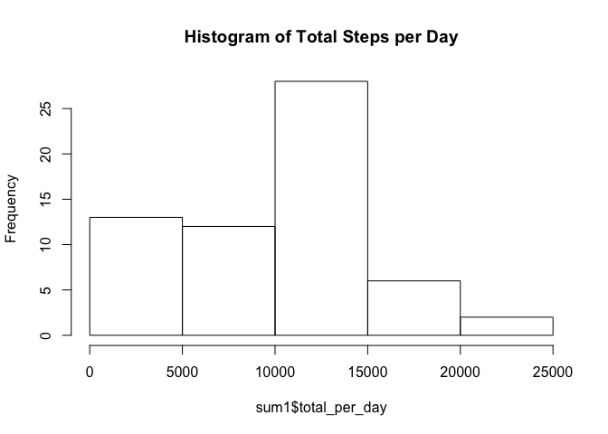
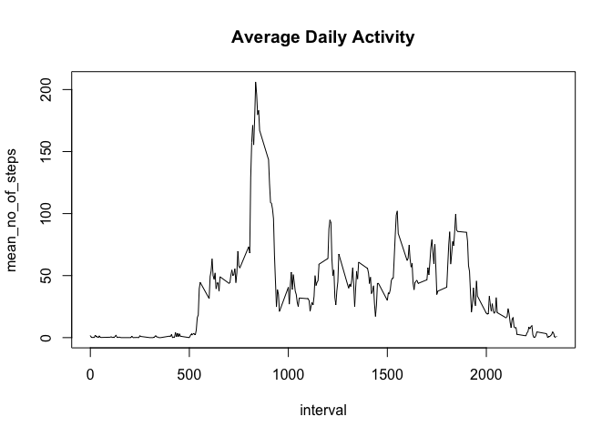
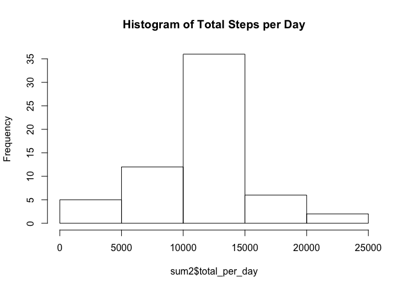
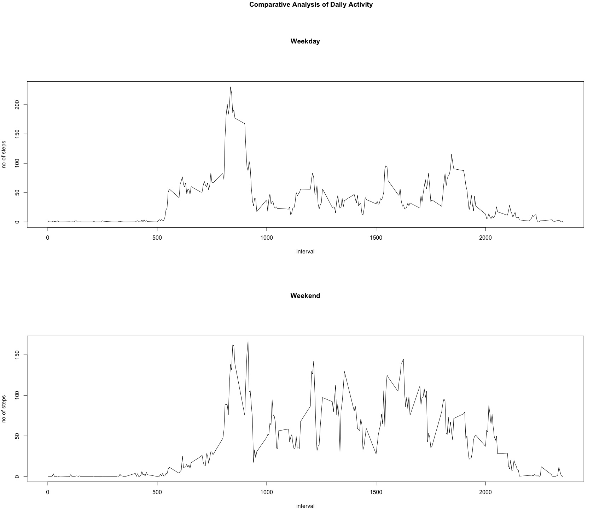

# Reproducible Research: Peer Assessment 1


## Loading and preprocessing the data

```r
library(dplyr)
```

```
## 
## Attaching package: 'dplyr'
```

```
## The following objects are masked from 'package:stats':
## 
##     filter, lag
```

```
## The following objects are masked from 'package:base':
## 
##     intersect, setdiff, setequal, union
```

```r
activity_data<-read.csv("activity.csv")
```


## What is mean total number of steps taken per day?

```r
sum1<-activity_data %>% group_by(date) %>% summarize(total_per_day = sum(steps,na.rm=TRUE))
hist(x=sum1$total_per_day, main = "Histogram of Total Steps per Day")
```

<!-- -->

```r
mean1<-mean(sum1$total_per_day)
median1<-median(sum1$total_per_day)
```
The mean of total number of steps per day is 9354.23 and the median of total number of steps per day is 1.0395\times 10^{4}
_____________________________________________________________________________________________________________


## What is the average daily activity pattern?

```r
avg1<- activity_data %>% group_by(interval) %>% summarize(mean_no_of_steps = mean(steps,na.rm=TRUE))
plot(avg1,type = "l", main = "Average Daily Activity")
```

<!-- -->

```r
max1<-max(avg1$mean_no_of_steps)
int_max<-avg1[avg1$mean_no_of_steps==max1,1]
```
The 5-minute interval, on average across all the days in the dataset, containing the maximum number of steps is 
 835
_____________________________________________________________________________________________________________


## Imputing missing values

```r
  sum(is.na(activity_data$steps))
```

```
## [1] 2304
```
The strategy chosen for replacing missing values is using the mean for the 5 minute interval 

```r
  mod_activity_data<-activity_data
  for (i in 1:length(mod_activity_data$steps)){
    if (is.na(mod_activity_data[i,"steps"])){
      mod_activity_data[i,"steps"]<-avg1[avg1$interval==mod_activity_data[i,"interval"],"mean_no_of_steps"]
    }
  }
# All missing values removed
  sum(is.na(mod_activity_data$steps))
```

```
## [1] 0
```

```r
sum2<-mod_activity_data %>% group_by(date) %>% summarize(total_per_day = sum(steps,na.rm=TRUE))
hist(x=sum2$total_per_day, main = "Histogram of Total Steps per Day")
```

<!-- -->

```r
mean2<-mean(sum2$total_per_day)
median2<-median(sum2$total_per_day)
```
The modified mean of total number of steps per day is 1.076619\times 10^{4} and the median of total number of steps per day is 1.076619\times 10^{4}. 

After imputing the missing values, the mean has shifted from 9354.23 to 1.076619\times 10^{4}. The median has shifted from 1.0395\times 10^{4} to 1.076619\times 10^{4}.
_____________________________________________________________________________________________________________


## Are there differences in activity patterns between weekdays and weekends?

```r
  mod_activity_data$day<-ifelse(weekdays(as.Date(mod_activity_data[,"date"],format = "%Y-%m-%d")) %in% c("Monday", "Tuesday", "Wednesday", "Thursday", "Friday"),"Weekday","Weekend")
weekday_data<-subset(mod_activity_data,mod_activity_data$day=="Weekday")
weekday_activity<-weekday_data %>% group_by(interval) %>% summarize(no_of_steps = mean(steps))
weekend_data<-subset(mod_activity_data,mod_activity_data$day=="Weekend")
weekend_activity<-weekend_data %>% group_by(interval) %>% summarize(no_of_steps = mean(steps))
par(mfrow =c(2,1), mar = c(4,4,12,4))
plot(x<-weekday_activity$interval,y<-weekday_activity$no_of_steps, type = "l", main = "Weekday", xlab="interval", ylab= "no of steps")
plot(x<-weekend_activity$interval,y<-weekend_activity$no_of_steps, type = "l", main = "Weekend",xlab="interval", ylab= "no of steps")
title(main = "
      Comparative Analysis of Daily Activity", outer = TRUE)
```

<!-- -->
